# 정진팜 실적관리 시스템 — 사용자 매뉴얼

| 항목 | 내용 |
|------|------|
| **대상** | 관리자(CSO), 영업사원 |
| **버전** | 2026-05-29 (Laravel 재구축 기준) |
| **스크린샷** | [`images/`](images/) — 로컬 `http://localhost:8088` 기준 자동 캡처 |
| **HTML 미리보기** | [`USER_MANUAL.html`](USER_MANUAL.html) — 스크린샷 포함 브라우저용 (`npm run manual:html`) |
| **개발·설계 문서** | [`docs/README.md`](../README.md) — 개발자·기획용 (본 매뉴얼과 구분) |

**브라우저에서 스크린샷까지 보려면** (MD만으로는 에디터·GitHub에 따라 이미지가 안 보일 수 있음):

```bash
npm run manual:html          # → docs/manual/USER_MANUAL.html
open docs/manual/USER_MANUAL.html
```

스크린샷 재캡처 + HTML 한 번에:

```bash
npm run manual:build         # manual:screenshots + manual:html
```

공유용 단일 파일(이미지 base64 내장):

```bash
npm run manual:html:standalone   # → USER_MANUAL.standalone.html
```

---

## 스크린샷 목록

| 파일 | 화면 |
|------|------|
| `01-login.png` | 로그인 |
| `02-admin-dashboard.png` | 관리자 대시보드 |
| `03-notices.png` | 공지사항 목록 |
| `04-products.png` | 제품 목록 |
| `05-companies.png` | 거래처 목록 |
| `06-performance-list.png` | 실적 목록 |
| `07-performance-create.png` | 실적 등록 |
| `08-settlements.png` | 정산 목록 |
| `09-commission-summary.png` | 수수료 명세(관리자) |
| `10-monthly-report.png` | 월간 보고서 |
| `11-sales-quotas.png` | 목표 관리 |
| `12-users.png` | 사용자 관리 |
| `13-pharmacies.png` | 약국 목록 |
| `14-performance-detail.png` | 실적 상세 |
| `15-settlement-detail.png` | 정산 상세 |
| `16-company-detail.png` | 거래처 상세(담당 배정) |
| `20-sales-dashboard.png` | 영업 대시보드 |
| `21-sales-performance-list.png` | 실적 목록(영업) |
| `22-sales-performance-create.png` | 실적 등록(영업) |
| `23-sales-commission-statement.png` | 수수료 명세서(영업) |

---

## 1. 시스템이 하는 일

정진팜 실적관리 시스템은 **영업 실적 등록 → 검수·승인 → 거래처별 월 정산 → 수수료 확인**까지 한곳에서 처리합니다.

- **영업사원**: 담당 거래처에 대한 실적을 등록·제출하고, 본인 수수료·목표 달성률을 확인합니다.
- **관리자**: 제품·거래처 마스터, 실적 검수·승인, 정산 생성·지급, 전사 보고서·사용자 관리를 담당합니다.

---

## 2. 로그인

1. 브라우저에서 시스템 주소(예: `http://localhost:8088`)에 접속합니다.
2. **이메일**과 **비밀번호**를 입력한 뒤 로그인합니다.
3. 비활성(`is_active = false`) 계정은 로그인할 수 없습니다. 계정이 잠겼다면 관리자에게 문의하세요.
4. 최초 로그인 후 **관리 → 설정(프로필)** 에서 비밀번호를 변경하는 것을 권장합니다.

> 관리자가 발급한 **임시 비밀번호**로 첫 로그인한 경우, 반드시 본인 비밀번호로 변경하세요.

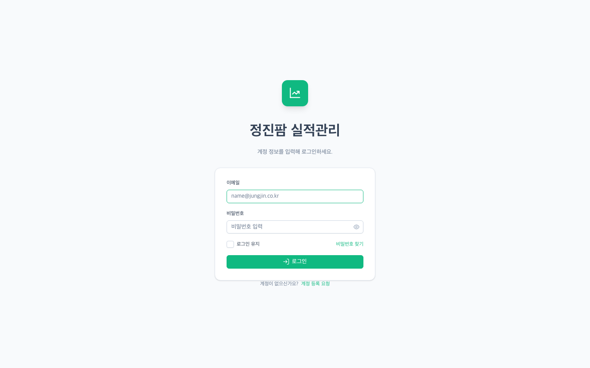

*그림 1. 로그인 화면*

---

## 3. 화면 구성

- **왼쪽 메뉴**: 기능별 메뉴(역할에 따라 일부만 표시)
- **상단**: 사용자 이름, 로그아웃, 모바일에서는 메뉴 열기 버튼
- **본문**: 목록·상세·등록 폼
- **알림**: 작업 성공·오류 메시지는 화면 상단(Toast) 또는 목록 위 배너로 표시됩니다.

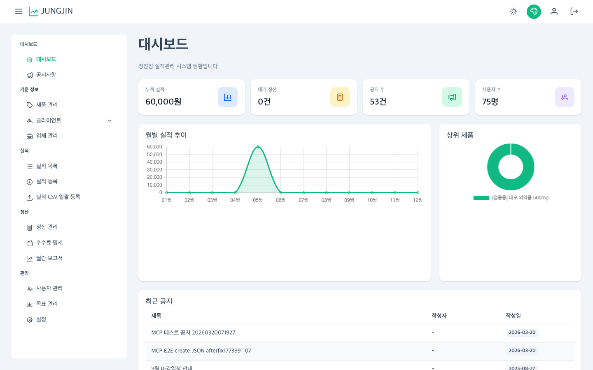

*그림 2. 관리자 대시보드 — 왼쪽 메뉴·상단 사용자 영역·본문 카드/차트*

---

## 4. 역할과 메뉴

### 4.1 역할

| 역할 | 설명 |
|------|------|
| **관리자 (admin)** | 전체 데이터 조회·마스터 관리·실적 검수·정산·사용자 관리 |
| **영업사원 (sales)** | 본인 실적 등록·조회, 공지 확인, 본인 정산·수수료·목표 조회 |

### 4.2 메뉴 구조 (2026-05, GAP-9 반영)

| 메뉴 그룹 | 항목 | 경로 | 관리자 | 영업사원 |
|-----------|------|------|:------:|:--------:|
| 대시보드 | 대시보드 | `/dashboard` | ✅ | — |
| 대시보드 | 영업 대시보드 | `/sales/dashboard` | — | ✅ |
| 대시보드 | 공지사항 | `/notices` | ✅ | ✅ |
| **마스터 관리** | 마스터 홈 | `/master-data` | ✅ | — |
| 마스터 관리 | 의약품 관리 | `/products` | ✅ | 조회 |
| 마스터 관리 | 약국 관리 | `/pharmacies` | ✅ | 조회 |
| 마스터 관리 | 병의원 관리 | `/hospitals` | ✅ | 조회 |
| **거래처** | 업체 관리 | `/companies` | ✅ | 조회 |
| **실적** | 실적 목록·등록·CSV | `/performance` … | ✅ | ✅(본인) |
| **정산** | 정산·수수료·월간 보고서 | `/settlements` … | ✅ | 본인 분 |
| **관리** | 사용자·목표·영업사원(조회)·설정 | `/users` … | ✅ | 설정만 |

---

## 5. 관리자 사용법

### 5.1 대시보드 (`/dashboard`)

- **통계 카드**: 승인 실적 매출 합계, 미확정 정산 건수, 공지 수, 사용자 수
- **월별 매출 차트**: 당해 연도 승인 실적 기준
- **상위 제품·최근 공지·영업사원 목표 달성률** 요약


*그림 3. 관리자 대시보드*

### 5.2 공지사항

| 작업 | 방법 |
|------|------|
| 작성 | 목록 → **등록** → 제목·본문, 필요 시 **상단 고정(필수)** |
| 첨부 | 파일 최대 10개, 각 20MB 이하 (PDF, HWP, Office, 이미지, ZIP 등) |
| 읽음 확인 | 상세 하단 **읽음 현황** — 전체 대비 읽은 비율·미열람자 확인 |

영업사원은 공지를 열면 자동으로 읽음 처리됩니다.

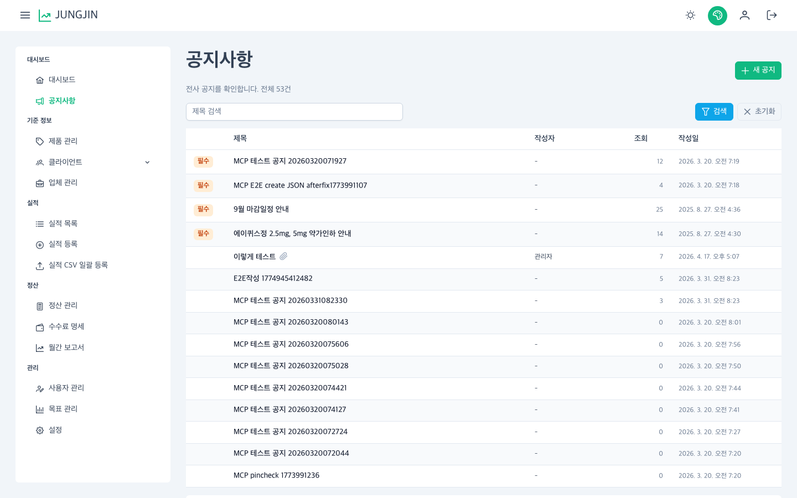

*그림 4. 공지사항 목록*

### 5.3 제품 관리

1. **등록**: 제품명, 보험코드, 제품코드, 제약사, 규격 등 입력
2. **가격 이력**: 보험약가 또는 매출가를 기간별로 등록
3. **수수료율**: 거래처 등급(A~E)·기간별 수수료율 매트릭스 설정
4. **거래처 예외 단가**: 특정 거래처만 다른 단가·수수료가 필요할 때 설정
5. **승인 흐름**: `초안 → 제출 → 검수 → 승인` (반려 시 수정 후 재진행)
6. **판매 가능 조건**: **승인됨**이고 **판매중(active)** 인 제품만 실적 등록 가능

**CSV 일괄 등록**: 제품 목록 → **CSV 가져오기** 메뉴에서 샘플 형식 확인 후 업로드

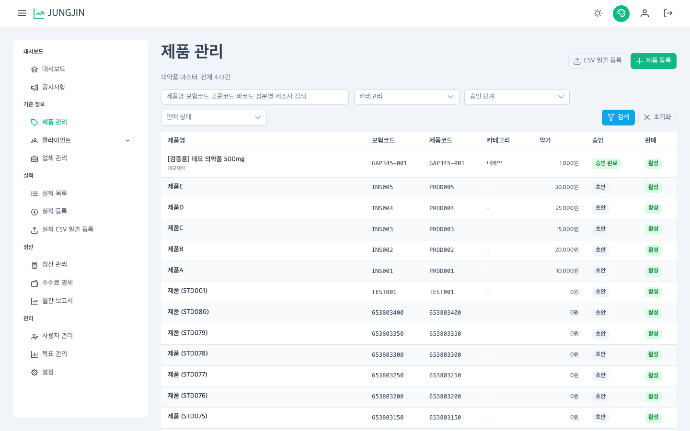

*그림 5. 제품 관리 목록*

### 5.4 거래처(업체) 관리

- 거래처명, 사업자번호, 담당자, **기본 수수료 등급** 관리
- **승인 상태**가 `승인됨`인 거래처만 실적 등록 가능
- **담당 영업사원 배정**: 거래처 상세 → 담당 영업사원 추가·해제 (동일 조합 중복 불가)
- 최근 6개월 정산 요약 카드로 거래처별 정산 이력 확인

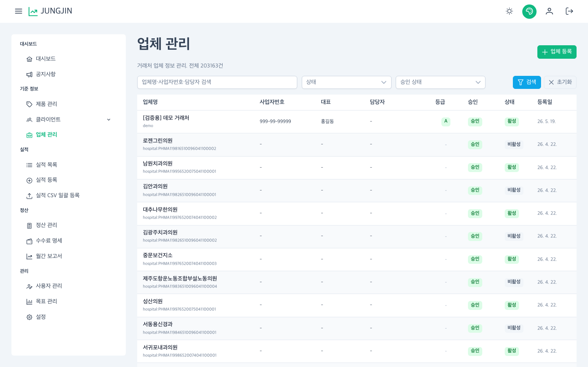

*그림 6. 업체(거래처) 관리 목록*

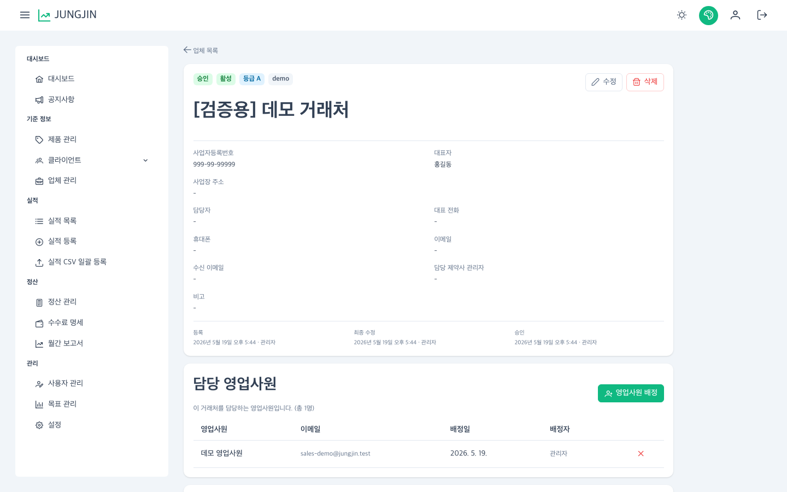

*그림 7. 거래처 상세 — 담당 영업사원 배정 카드*

### 5.5 약국·병원

- 마스터 조회·등록·수정 (관리자)
- **CSV 일괄 등록** 지원 (약국·병원 각각)

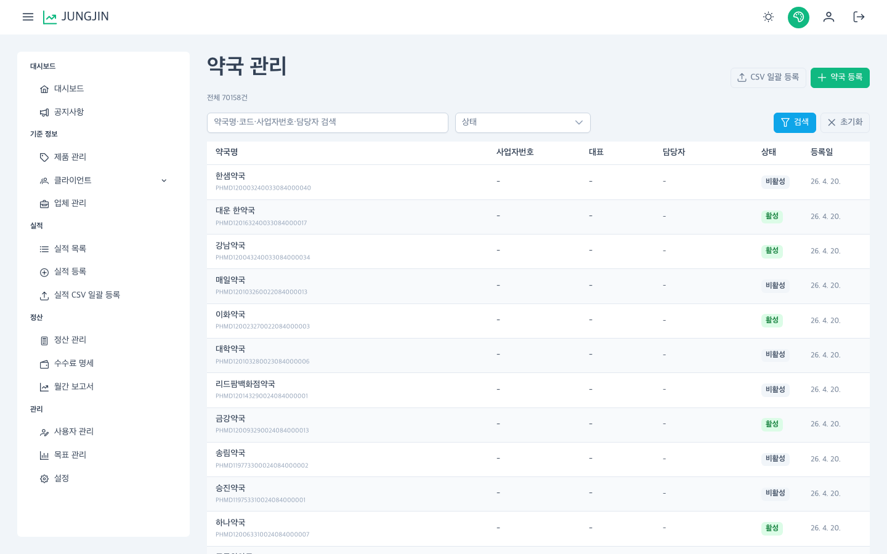

*그림 8. 약국 마스터 목록*

### 5.6 실적 관리

#### 등록·일괄 등록

- **단건**: 실적 등록 → 거래처·제품·실적일·수량 → 화면에서 **단가·수수료·매출액** 미리보기 확인 후 저장
- **CSV**: 실적 CSV 일괄 등록 — 샘플 파일 형식 준수
- **제한**: 미승인 거래처·판매 불가 제품·미래 실적일은 등록 불가

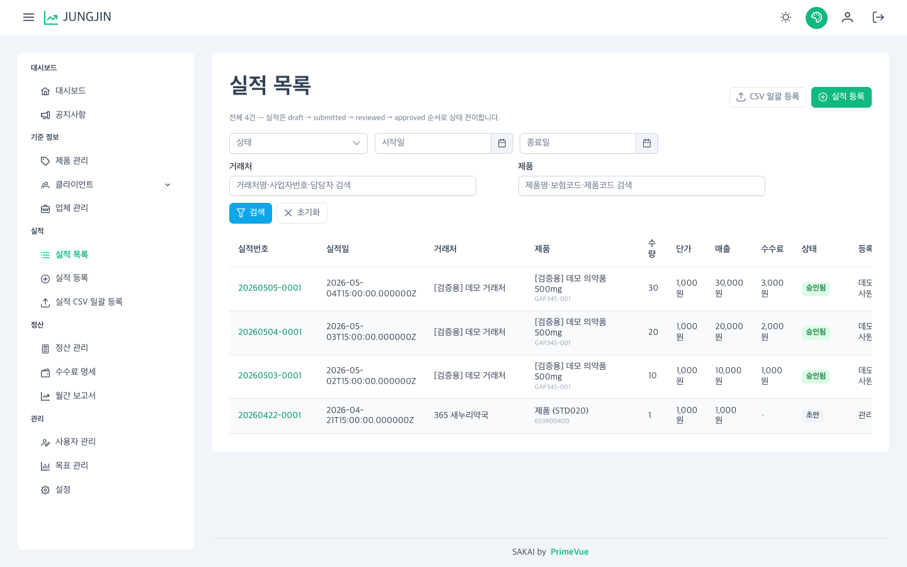

*그림 9. 실적 목록 — 상태·기간 필터*

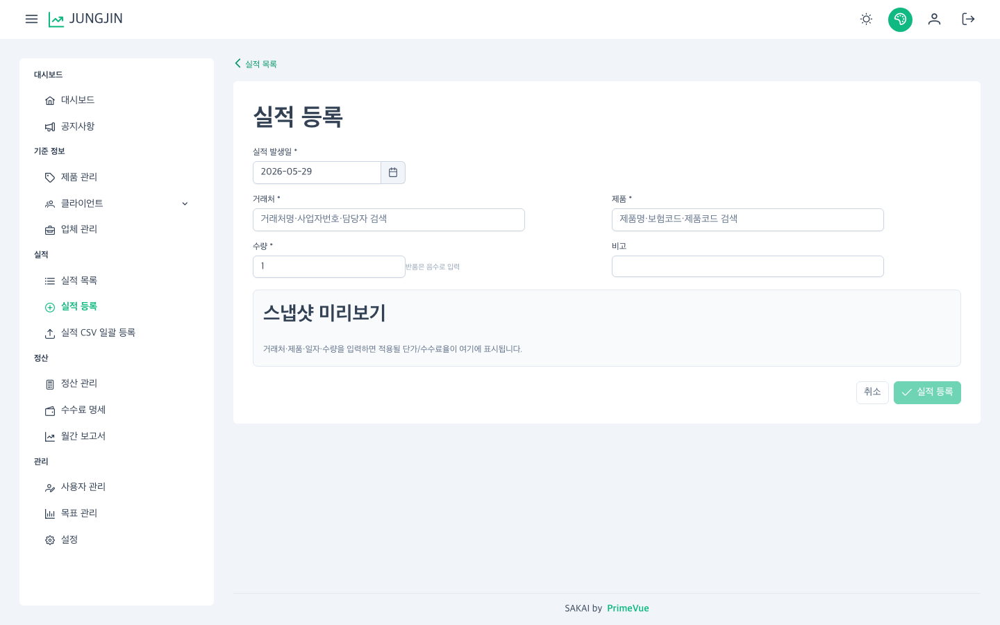

*그림 10. 실적 등록 — 단가·수수료 미리보기*

#### 검수·승인 (관리자)

| 현재 상태 | 관리자 작업 | 다음 상태 |
|-----------|-------------|-----------|
| 제출됨 (submitted) | 검수 | 검수됨 (reviewed) |
| 검수됨 (reviewed) | 승인 | 승인됨 (approved) |
| 제출/검수 | 반려 (사유 필수) | 반려됨 (rejected) |
| 승인됨 | 취소 | 취소됨 (cancelled) |

- **증빙 파일**: 실적 상세에서 PDF·이미지·문서 첨부(최대 5개, 파일당 10MB). 검수 시 근거로 활용
- 정산에 이미 포함된 실적은 수정·취소할 수 없습니다.

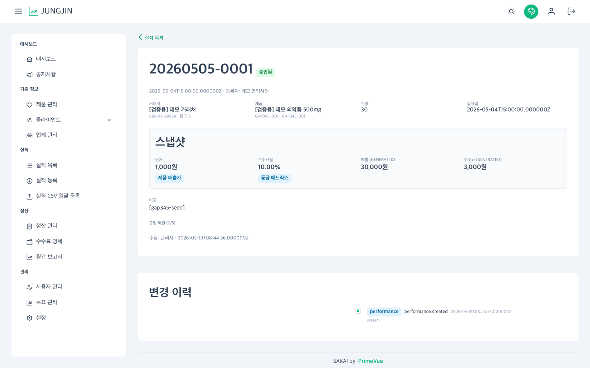

*그림 11. 실적 상세 — 상태·금액·증빙 파일·검수/승인 버튼*

### 5.7 정산 관리

#### 정산 생성

1. **정산 관리** → **정산 생성**
2. **거래처** + **정산 월** 선택
3. 해당 월 **승인된 실적**이 자동 집계되어 정산 번호(`YYYYMM-NNNN`)가 부여됩니다.

#### 검토·확정·지급

| 상태 | 의미 | 가능 작업 |
|------|------|-----------|
| 초안 (draft) | 생성 직후 | 재계산, 확정, 취소 |
| 확정 (confirmed) | 금액 확정 | 지급 처리, 증빙 업로드, Excel/PDF |
| 지급완료 (paid) | 지급 기록 완료 | 증빙 추가,보내기 |
| 취소 (cancelled) | 무효 | — |

- **재계산**: 승인 실적 기준으로 라인을 다시 만듭니다. 확정 이후에는 불가
- **미반영 실적 경고**: 확정·재계산 이후 새로 승인된 실적이 있으면 배너 표시 → 재계산 권장
- **지급 완료**: 지급일(필수), 지급 수단(계좌이체/현금/기타), **Batch No.**(묶음 번호), 메모 입력
- **지급 증빙**: 확정·지급완료 상태에서 이체확인서 등 첨부 (파일당 10MB)
- **목록 필터**: Batch No.로 같은 묶음 지급 정산만 조회
- **보내기**: 상세 화면에서 Excel·PDF (지급 정보 포함)

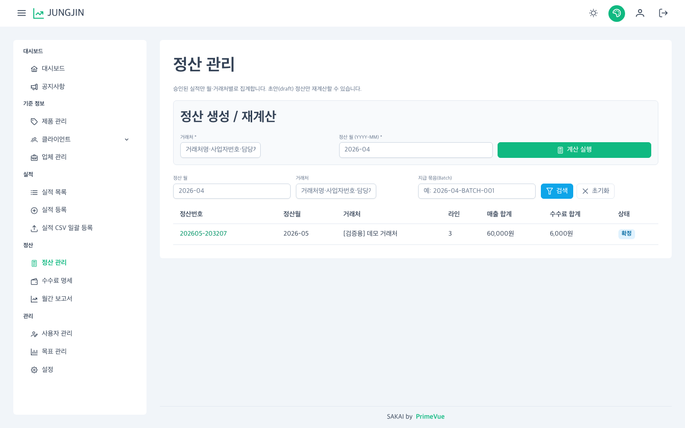

*그림 12. 정산 목록 — Batch No. 필터*

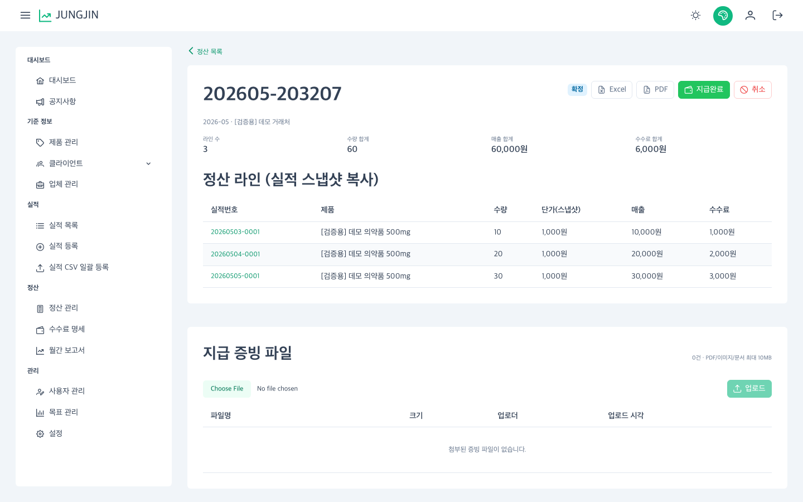

*그림 13. 정산 상세 — 라인·지급 정보·증빙*

### 5.8 수수료 명세 (`/commission-summary`)

- 기간(월 또는 from~to) 선택 → **영업사원별 수수료 합계** 테이블
- 개인 **명세서** 화면·PDF 다운로드
- Excel보내기 (관리자)

집계 기준: **승인된 실적**의 `commission_amount` 합계

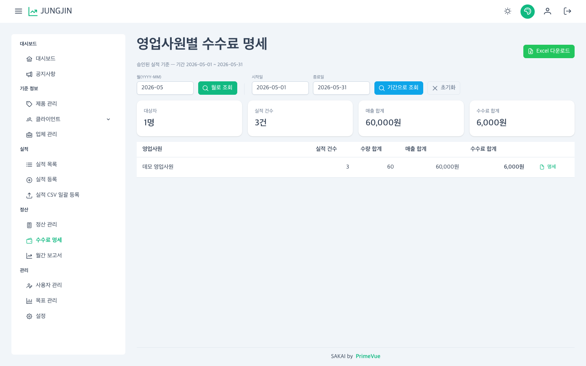

*그림 14. 영업사원별 수수료 명세(관리자)*

### 5.9 월간 보고서 (`/reports/monthly`)

- 기준 월(또는 기간) 선택
- 화면 **3개 탭**: 거래처별 / 영업사원별 / 제품별 요약
- **Excel 다운로드**: 1개 파일, 3개 시트 (승인 실적 기준 집계)

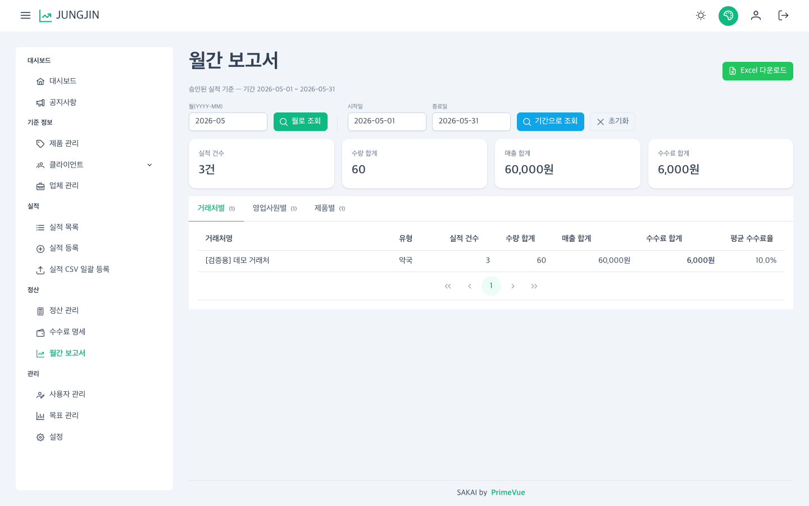

*그림 15. 월간 보고서 — 거래처/영업사원/제품 탭*

### 5.10 목표 관리 (`/sales-quotas`)

- 영업사원·제품(선택)·기간(월/분기/년)·목표 금액 등록·수정·삭제
- 달성률은 **승인 실적 매출(subtotal)** 기준으로 자동 계산
- 관리자 대시보드·영업 대시보드에 달성률 표시

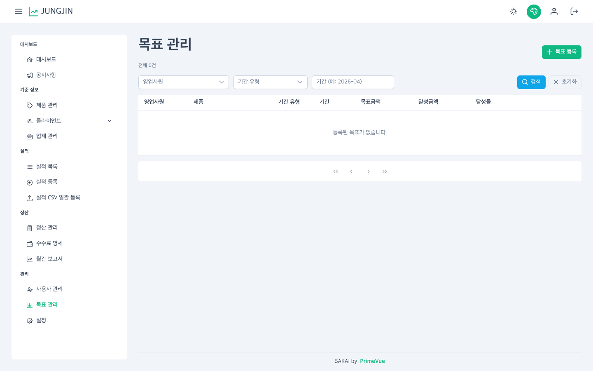

*그림 16. 목표 관리 — 달성률*

### 5.11 사용자 관리 (`/users`)

| 작업 | 설명 |
|------|------|
| 등록 | 이름, 이메일, 역할(admin/sales), 비밀번호 |
| 비밀번호 재설정 | 관리자가 임시 비밀번호 설정 |
| 비활성화 | 로그인 차단 (데이터는 유지) |
| 삭제 | 사용자 제거 |

> 관리자 **본인** 계정은 삭제·비활성화할 수 없습니다.

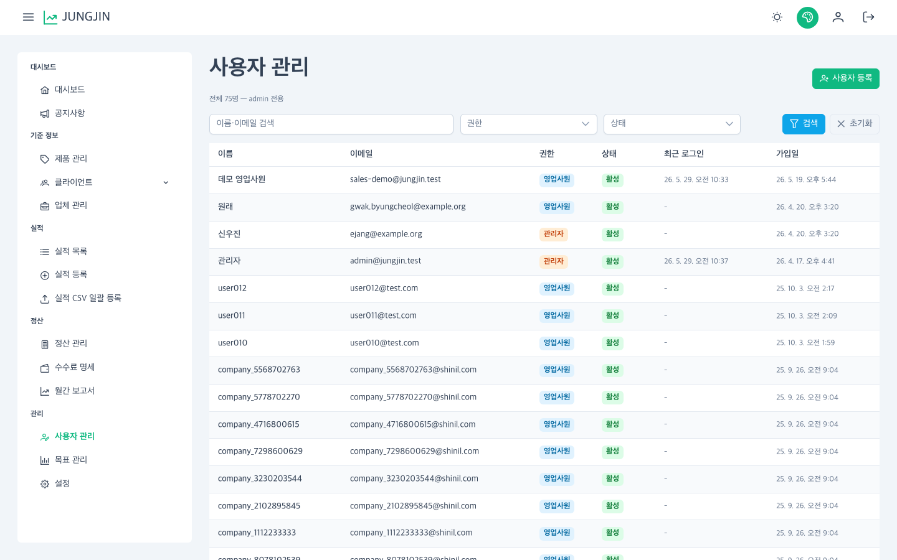

*그림 17. 사용자 관리*

---

## 6. 영업사원 사용법

### 6.1 영업 대시보드 (`/sales/dashboard`)

- 이번 달 **본인 실적 매출·수수료** 요약
- 실적 **상태별 건수**, **월별 추이 차트**
- **목표 달성률**, **이번 달 수수료** + 명세서 바로가기
- **내 담당 거래처** (상위 5건 + 전체 보기)
- **최근 반려 실적** — 반려 사유 확인 후 수정·재제출
- **월별 실적 차트** — 최근 12개월 승인 실적 추이 (P2-8)
- **제출 대기** — draft 실적 목록으로 바로가기 (P2-8)

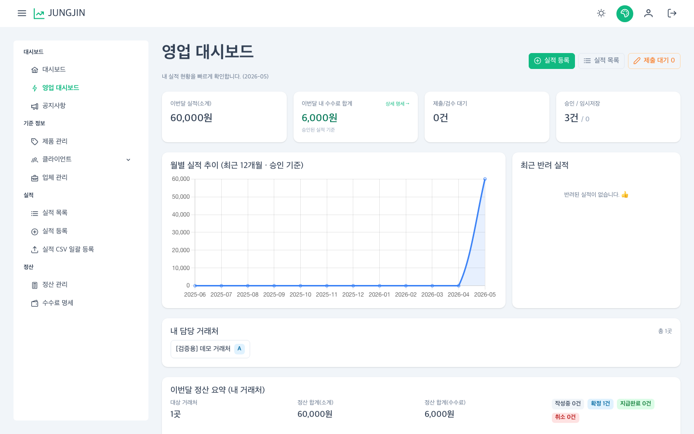

*그림 18. 영업사원 대시보드 — 목표·수수료·담당 거래처·반려 실적*

### 6.2 실적 등록·제출

1. **실적 등록** → 거래처·제품·실적일·수량 입력
2. 미리보기 금액 확인 → 저장 (상태: **임시저장/draft**)
3. 실적 상세 → **증빙 파일** 첨부(선택)
4. 내용 확인 후 **제출** → 상태: **제출됨**
5. 반려된 경우: 상세에서 **반려 사유** 확인 → 수정 → 다시 **제출**

> 담당 거래처는 거래처 검색 시 목록 **상단에 우선** 표시됩니다.

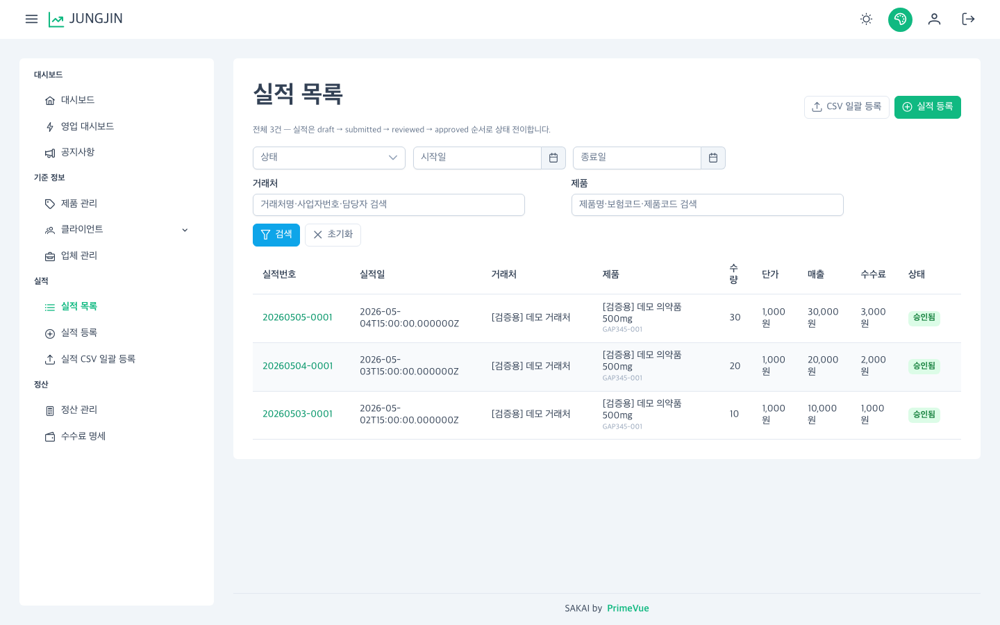

*그림 19. 실적 목록(본인 건만 표시)*

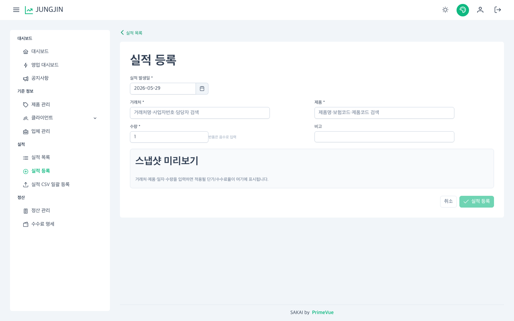

*그림 20. 실적 등록*

### 6.3 실적·정산 조회

- **실적 목록**: 본인이 등록한 실적만 표시 (상태·기간·거래처·제품 필터)
- **정산 관리**: 본인 실적이 포함된 정산만 조회·Excel/PDF 다운로드·지급 증빙 다운로드

### 6.4 수수료 명세

- 메뉴 **수수료 명세** → 본인 **개인 명세서**
- 기간 선택 후 PDF 다운로드 가능

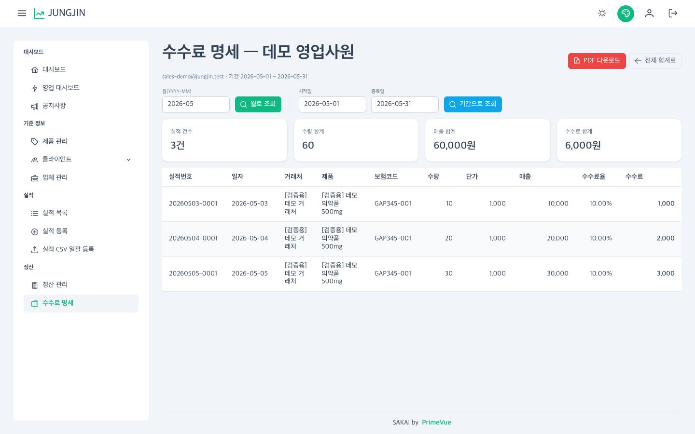

*그림 21. 개인 수수료 명세서*

### 6.5 공지·프로필

- **공지사항**: 필수(상단 고정) 공지 우선 확인
- **설정**: 이름·이메일·비밀번호 변경

---

## 7. 업무 시나리오 (단계별)

### 7.1 신규 영업사원 온보딩

```
(관리자) 사용자 관리 → 등록 (역할: sales, 임시 비밀번호)
    ↓
(영업사원) 로그인 → 설정에서 비밀번호 변경
    ↓
(관리자) 거래처 상세에서 담당 영업사원 배정
    ↓
(영업사원) 영업 대시보드·공지 확인 후 실적 등록 시작
```

### 7.2 신제품 등록 후 실적 반영

```
(관리자) 제품 등록 → 가격·수수료율 설정 → 제출 → 검수 → 승인
    ↓
(영업사원) 실적 등록 시 해당 제품 선택 가능
```

### 7.3 실적 등록부터 승인까지

```
(영업사원) 실적 등록 → 제출
    ↓
(관리자) 실적 목록(제출됨) → 검수 → 승인
    ※ 이상 시: 반려 + 사유 → (영업사원) 수정 후 재제출
```

### 7.4 월말 정산·지급

```
(관리자) 해당 월 실적 승인 완료 확인
    ↓
정산 생성 (거래처 × 월) → 상세에서 금액 검토 → 재계산(필요 시)
    ↓
정산 확정 → 지급 완료(지급일·수단·Batch·메모) → 증빙 첨부
    ↓
(관리자/영업사원) Excel 또는 PDF보내기
```

### 7.5 월간 전사 보고

```
(관리자) 월간 보고서 → 기간 선택 → 탭별 미리보기 → Excel 다운로드
```

---

## 8. 상태 표시 (요약)

### 실적 상태

```
임시저장(draft) → 제출(submitted) → 검수(reviewed) → 승인(approved)
                      ↓                    ↓
                   반려(rejected) ←──────┘
                      ↓
              (수정 후 재제출)

승인(approved) → 취소(cancelled)  [관리자만]
```

### 정산 상태

```
초안(draft) → 확정(confirmed) → 지급완료(paid)
     ↓              ↓
  취소(cancelled) ←┘
```

### 제품 승인

```
초안 → 제출 → 검수 → 승인 → (필요 시) 단종
              ↓
           반려 → 수정 후 재진행
```

---

## 9. 단가·수수료가 정해지는 방법

실적 저장 시점에 아래 **우선순위**로 단가·수수료가 고정(스냅샷)됩니다. 이후 마스터 가격이 바뀌어도 이미 저장된 실적 금액은 변하지 않습니다.

| 순위 | 단가 | 수수료율 |
|:----:|------|----------|
| 1 | 거래처×제품 **예외 단가** | 거래처×제품 **예외 수수료** |
| 2 | 제품 **매출가** | **수수료율 매트릭스**(거래처 등급·기간) |
| 3 | 제품 **보험약가** | — |

**매출액** = 단가 × 수량  
**수수료** = 매출액 × 수수료율(해당 시)

---

## 10. 자주 묻는 질문 (FAQ)

**Q. 실적을 저장할 수 없어요.**  
- 거래처가 **승인됨**인지, 제품이 **승인·판매중**인지 확인하세요.  
- 실적일이 **오늘 이후**이면 등록할 수 없습니다.

**Q. 실적을 수정할 수 없어요.**  
- 이미 **정산 라인에 포함**된 실적은 수정·삭제가 불가합니다. 관리자에게 문의하세요.

**Q. 반려된 실적은 어떻게 하나요?**  
- 실적 상세에서 **반려 사유**를 확인한 뒤 수정하고 다시 **제출**하세요. 영업 대시보드의 **최근 반려** 목록에서 바로갈 수 있습니다.

**Q. 수수료 금액은 어디서 보나요?**  
- 영업사원: **영업 대시보드** 또는 **수수료 명세**.  
- 관리자: **수수료 명세** 집계 화면.

**Q. 정산 금액과 실적 합이 다릅니다.**  
- 정산은 **승인된 실적**만 포함합니다. 미제출·미승인 실적은 제외됩니다.  
- 승인 후 정산이 만들어졌다면 **재계산**이 필요할 수 있습니다(초안 상태만).

**Q. 파일을 다운로드할 수 없어요.**  
- 로그인 상태인지 확인하세요. 첨부 파일은 **인증된 사용자만** 다운로드할 수 있습니다.

**Q. 메뉴가 보이지 않아요.**  
- 역할(admin/sales)에 따라 메뉴가 다릅니다. 관리자 전용 기능은 영업사원 계정에 표시되지 않습니다.

---

## 11. 용어집

| 용어 | 설명 |
|------|------|
| 실적 | 거래처·제품·수량·실적일이 기록된 판매 1건 |
| 정산 | 특정 거래처의 특정 월 **승인 실적**을 묶은 청구 단위 |
| 보험약가 | 심평원 고시 기준 약가 |
| 매출가 | 실제 판매 단가 |
| 예외 단가 | 특정 거래처에만 적용하는 단가·수수료 |
| 수수료율 매트릭스 | 제품·거래처 등급·기간별 수수료율 표 |
| Batch No. | 같은 지급 건을 묶는 지급 묶음 번호 |
| 스냅샷 | 실적 저장 시점에 고정된 단가·수수료 |

---

## 12. 문의·장애

- **계정·권한**: 관리자(CSO)  
- **시스템 장애·오류 화면**: 관리자에게 스크린샷·발생 시각·수행한 메뉴를 함께 전달해 주세요.

---

## 부록: 개발·운영 문서 (참고)

| 문서 | 용도 |
|------|------|
| [`planning/PRODUCT_SPEC.md`](../planning/PRODUCT_SPEC.md) | 기능 명세·권한 표 (상세) |
| [`planning/ROADMAP.md`](../planning/ROADMAP.md) | 개발 진행·예정 기능 |
| [`operations/OPERATIONS.md`](../operations/OPERATIONS.md) | 서버·백업·큐 (운영 담당) |

*본 매뉴얼은 현재 구현된 화면·권한을 기준으로 작성되었습니다. 메뉴나 기능이 추가되면 [`PRODUCT_SPEC.md`](../planning/PRODUCT_SPEC.md) 및 본 문서를 함께 갱신합니다.*
